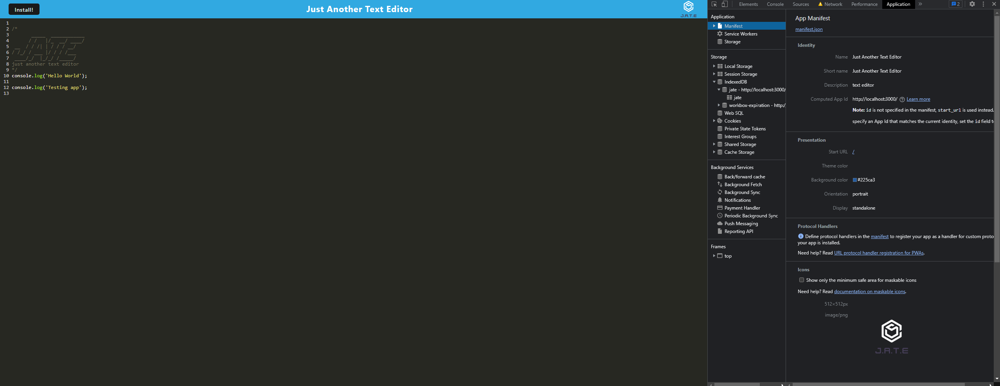
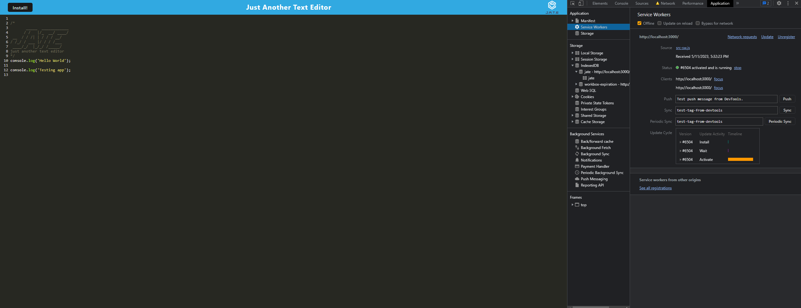
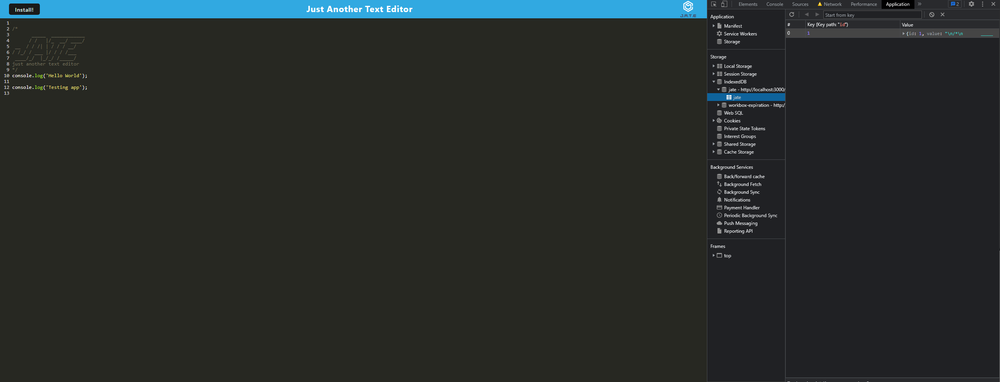
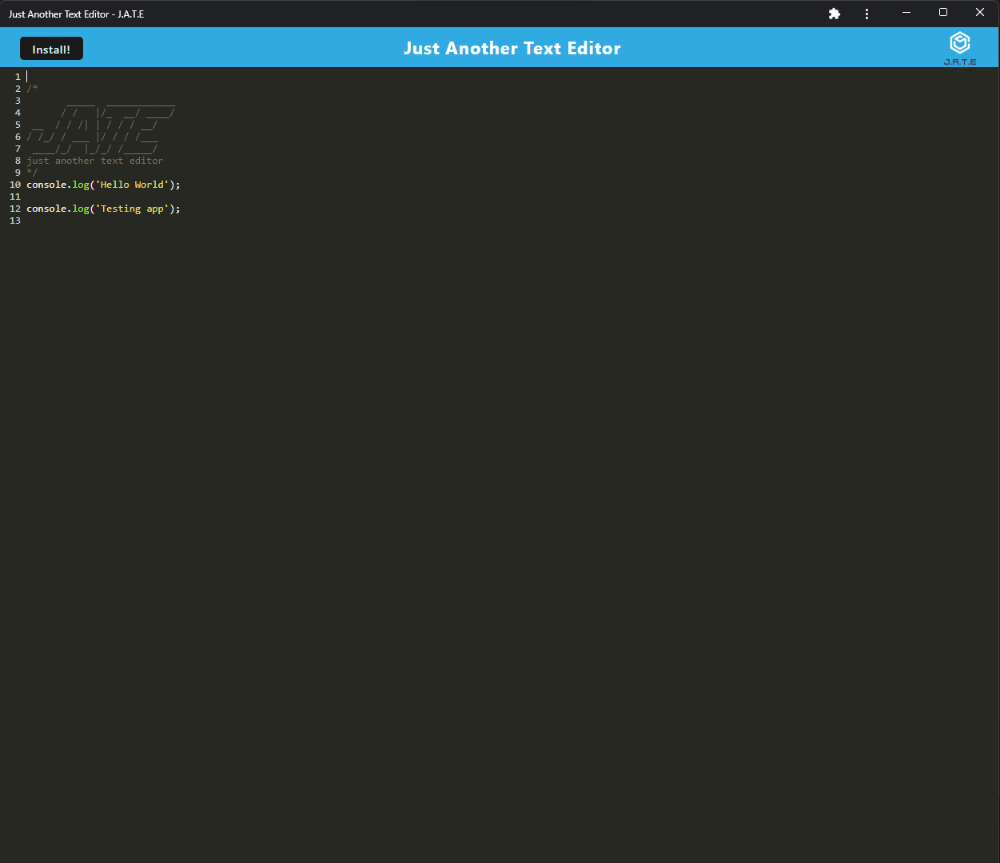

# Text Editor

## Table-of-Contents

- [Description](#description)
- [Technologies](#technologies)
- [Installation](#installation)
- [Screenshots](#screenshots)
- [Contact](#contact)

## [Description](#table-of-contents)

This app is a basic text editor that allows users to write code and save it to a database.

##[Technologies](#table-of-contents)

- Webpack
- Babel
- Node.js
- Express
- IndexedDB

## [Installation](#table-of-contents)

Users can install the app from the browser by clicking the 'Install!' button. This will ask the user if they want to install the app, and it will install as a desktop shortcut if they choose to do so.

## [Screenshots](#table-of-contents)

## [Contact](#table-of-contents)

- Github: [psong1](https://github.com/psong1)

- Email me: paulsong29@gmail.com
